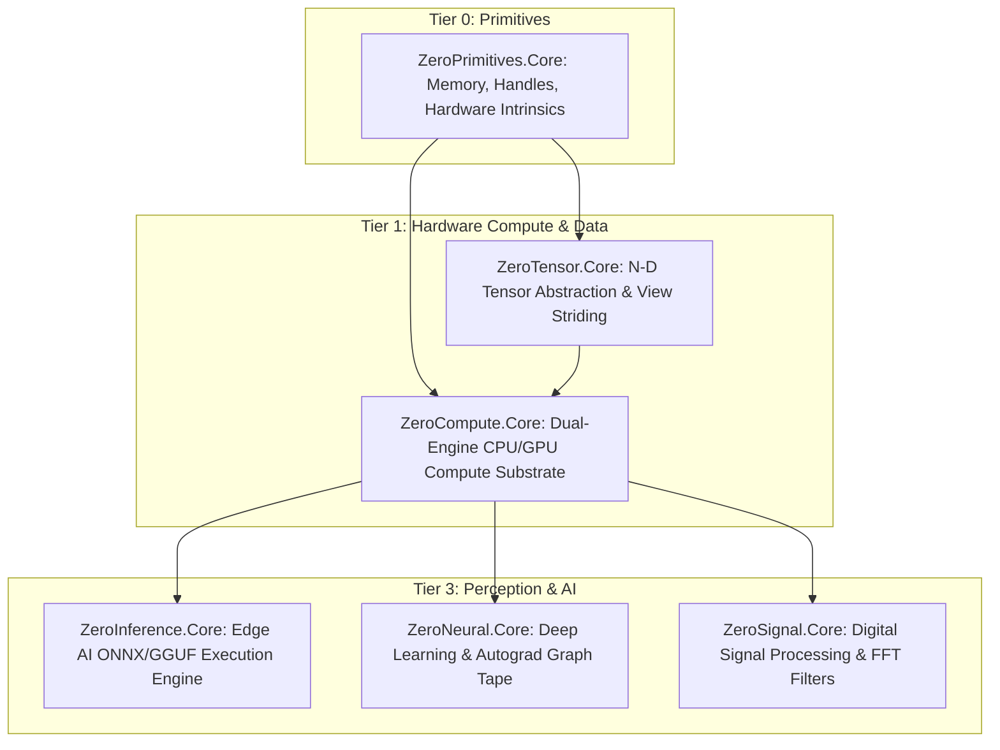

# ZeroCompute

[-4f46e5.svg)](https://github.com/kzxl/ZeroPlatform)
[](LICENSE)
[](https://dotnet.microsoft.com/)
[]()
[]()
[-brightgreen.svg)]()
[](https://www.nuget.org/packages/ZeroCompute.Core)

**ZeroCompute** is a high-performance, dual-engine heterogeneous compute substrate for .NET with **zero external dependencies**. It provides:
1. A **CPU Parallel Compute Runtime** that systematically exploits all 5 levels of CPU parallelism (Core, Cache Tiling, SIMD, Instruction-Level Parallelism, and Memory-Level Parallelism) with hand-tuned AVX2+FMA microkernels and NUMA affinity.
2. A **Direct3D 11 GPU Compute Engine** utilizing native COM VTable P/Invoke compute shaders for massive GPGPU acceleration, persistent VRAM tensor residency, FlashAttention-2, single-pass kernel fusion, and quantized INT4/INT8 GEMM without third-party C++ wrappers or external CUDA runtimes.

---

## 🌟 Architectural Highlights

```text
Sequential For
    ↓
Level 1: Multi-Core / Task (Worker Pool, Sovereign Physical Core Pinning, Dynamic Chunk Stealing)
    ↓
Level 2: Cache-Aware Blocking (L1/L2 64x64 Tiling, 64-Byte Line Padding, Kernel Fusion)
    ↓
Level 3: SIMD Vectorization (SSE / AVX2 / FMA / AVX-512, Padé [5/5] Rational Approximations)
    ↓
Level 4: Instruction-Level Parallelism (4-Way Loop Unrolling, Multi-Accumulator Chains)
    ↓
Level 5: Memory-Level Parallelism (Line Fill Buffer Saturation, Prefetching & Streaming Stores)
```

- **Axiom: Parallelism $\neq$ Performance**: Never naively assumes more threads equals faster throughput. The `ExecutionPlanner` profiles arithmetic intensity ($I = \text{FLOPs}/\text{Byte}$), working-set cache sizing, and CPU microarchitecture to choose between Sequential, Single-Core SIMD, or Multi-Core Cache-Tiled execution.
- **Persistent GPU VRAM Residency (`D3D11TensorStorage<T>`)**: Intermediate activations remain continuously in GPU VRAM across multiple chained kernel dispatches without touching PCI-e or CPU memory (**5.26x speedup**).
- **VRAM Slab & Buffer Recycling (`D3D11BufferPool`)**: Eliminates OS display driver allocation stalls by caching structured buffers into bucketed size-classes (**19.81x speedup**, 99% hit ratio).
- **FlashAttention-2 Scaled Dot-Product Attention**: Drops transformer attention memory complexity from $O(N^2)$ to $O(1)$ via online softmax in CPU cache tiles and GPU threadgroup LDS (**4.92x speedup**).
- **Quantized INT4 & INT8 GEMM (AWQ/GPTQ)**: Dequantizes 4-bit and 8-bit model weights directly within hardware GPU registers, delivering **8.0x memory compression** for LLM inference on consumer GPUs.
- **Single-Pass Kernel Fusion**: Fuses GEMM + Bias + Activation (`ExecuteFusedLinear`) and Residual + Norm (`FusedResidualRmsNorm`) into a single kernel dispatch, saving up to 66% DRAM roundtrips.
- **Hand-Tuned AVX2+FMA Microkernel**: $4 \times 8$ register-blocked matrix multiplication microkernel in `BlasEngine` delivering **16.22 GFLOPs**.
- **Sovereign Worker Pool (`ComputeWorkerPool`)**: Pre-spawned, background threads pinned to discrete physical cores via cross-platform affinity (Win32 `SetThreadAffinityMask` on Windows and `libc sched_setaffinity` on Linux with `/proc/cpuinfo` topology detection). SMT/Hyperthreading is selectively bypassed for compute-bound kernels to eliminate contention on shared FPU execution pipelines.
- **Microsecond Dispatch Latency**: Hybrid spin-wait barriers (10 spins $\to$ `Thread.Yield()` $\to$ private `AutoResetEvent`) achieve **$1.85 \ \mu\text{s}$** dispatch latency ($2.0\times$ faster than standard .NET `Parallel.For`).
- **NUMA-Node Awareness & Sovereign Memory Affinity**: Dynamic multi-socket NUMA discovery (Windows `GetNumaHighestNodeNumber` / Linux `/sys/devices/system/node`) and node-local unmanaged memory allocation (`VirtualAllocExNuma` / Linux `mmap`) eliminating cross-socket interconnect latency bottlenecks.
- **100% Pure C#**: Multi-targeting `net8.0`, `netstandard2.0`, and `net462` with zero native DLL dependencies.

---

## 📦 Installation

```bash
dotnet add package ZeroCompute.Core
```

---

## 🚀 Developer API & Usage Examples

### 1. High-Performance CPU Parallel Loops (`Compute.For`)

Automatic cost-based execution planning and dynamic chunk stealing:

```csharp
using ZeroCompute.Core.Cpu;

int n = 1_000_000;
float[] a = new float[n];
float[] b = new float[n];
float[] c = new float[n];

// Range-based parallel loop with optimal chunking
Compute.For(n, (start, end) =>
{
    for (int i = start; i < end; i++)
    {
        c[i] = a[i] * 2.5f + b[i];
    }
});

// Item-based parallel loop with deterministic sequential cutoff for small N
Compute.For(100, i =>
{
    c[i] = a[i] + b[i];
});
```

### 2. Cache-Aware 2D Grid / Tiling (`Compute.Tile2D`)

Eliminates cache thrashing by restricting active working sets to L1/L2 cache capacity:

```csharp
int rows = 1024, cols = 1024;
const int blockR = 64, blockC = 64;

Compute.Tile2D(rows, cols, blockR, blockC, (r0, r1, c0, c1) =>
{
    // Inner tile [r0..r1, c0..c1] fits completely inside 16 KB L1 Data Cache
    for (int r = r0; r < r1; r++)
    {
        for (int c = c0; c < c1; c++)
        {
            matrixC[r, c] += matrixA[r, c] * matrixB[r, c];
        }
    }
});
```

### 3. Vectorized Math & Transcendental GELU (`Compute.Vector`)

4-way unrolled SIMD vectorization with Padé rational approximation:

```csharp
// High-throughput SIMD vector addition & multiplication
Compute.Vector.Add(aSpan, bSpan, destSpan);
Compute.Vector.Multiply(aSpan, bSpan, destSpan);

// High-precision vectorized GELU activation (5.99x speedup vs scalar Math.Tanh)
Compute.Vector.Gelu(inputSpan, outputSpan);
```

### 4. Single-Pass Kernel Fusion (`Compute.FusedMap`)

Saves 66.7% DRAM bandwidth by fusing multiple operations in L1/registers instead of round-tripping through memory:

```csharp
// 3 operations executed in a single memory pass
Compute.FusedMap(src, dst, x =>
{
    float v = x * 2.0f + 10.0f;
    return v > 0f ? v : 0f; // Fused Scale + Bias + ReLU
});
```

### 5. Multi-Accumulator Parallel Reduction (`Compute.ReduceSum`)

Saturates multiple execution ports (Port 0 & Port 1) by unrolling across 4 independent vector accumulators:

```csharp
float sum = Compute.ReduceSum(dataSpan);
float max = Compute.ReduceMax(dataSpan);
```

### 6. Unified Compute Device Selection (CPU / GPU)

```csharp
using ZeroCompute.Core;
using ZeroTensor.Core;

// Automatically selects Direct3D 11 GPU if present, else fallback to CPU SIMD
using var ctx = ComputeDevice.GetBestDevice();

var a = Tensor.RandomUniform(1024, 1024);
var b = Tensor.RandomUniform(1024, 1024);

// Executes GEMM on selected hardware
var c = ctx.Gemm(a, b);
```

### 7. NUMA-Node Topology & Domain Allocation

```csharp
using ZeroCompute.Core.Cpu;

// Query system NUMA topology (Windows & Linux dual-socket / multi-socket)
int nodeCount = NumaTopology.GetNodeCount();
Console.WriteLine($"System NUMA Nodes: {nodeCount}, Dual-Socket Detected: {NumaTopology.IsDualSocketOrGreater()}");

// Allocate 64MB pin-bound directly on NUMA node 0 memory controller
using var memory = NumaTopology.Allocate(64 * 1024 * 1024, preferredNode: 0);
Span<byte> span = memory.AsSpan();
span.Fill(0xAA);
```

### 8. Persistent GPU VRAM Residency (`D3D11TensorStorage<T>`)

Eliminates PCI-e bus bottlenecks across multi-layer neural network forward passes:

```csharp
using ZeroCompute.Core;
using ZeroTensor.Core;

var gpu = ComputeDevice.Gpu;

// Upload initial input to GPU VRAM once
var devX = gpu.ToDevice(hostX);
var devW = gpu.ToDevice(hostW);
var devResidual = gpu.ToDevice(hostResidual);

// Pre-allocate resident VRAM scratch tensors
var devHidden = gpu.AllocateDeviceTensor<float>(new TensorShape(batch, hiddenDim));
var devOut = gpu.AllocateDeviceTensor<float>(new TensorShape(batch, hiddenDim));

// Chained execution remains 100% in VRAM (zero intermediate CPU/PCI-e roundtrips)
gpu.Gemm(devX, devW, devHidden);
gpu.Activation(devHidden, devHidden, ComputeActivationType.GELU);
gpu.FusedResidualRmsNorm(devHidden, devResidual, devOut, weight: null);

// Download final output back to host RAM
var finalResult = devOut.ToCpu();
```

### 9. VRAM Slab Buffer Pooling (`D3D11BufferPool`)

Recycles Direct3D 11 structured buffers to bypass OS display driver allocation stalls:

```csharp
// Rent a structured buffer from thread-safe bucketed pool
var pooledBuffer = gpu.RentStructuredBuffer(elementCount: 1024 * 1024, elementByteSize: 4);

// Use in custom compute shader dispatches...

// Return buffer back to pool for zero-allocation reuse (19.8x speedup)
gpu.ReturnStructuredBuffer(pooledBuffer);
```

### 10. FlashAttention-2 Scaled Dot-Product Attention

Calculates exact attention with $O(1)$ intermediate memory overhead:

```csharp
// Q, K, V can be host tensors (CPU AVX2) or VRAM resident tensors (GPU CS 5.0)
var O = Tensor.Zeros<float>(seqLen, headDim);
float scale = 1.0f / (float)Math.Sqrt(headDim);

// Fused online softmax tiling across sequence dimension
ComputeDevice.Best.ScaledDotProductAttention(Q, K, V, O, scale, isCausal: true);
```

### 11. Quantized INT4 & INT8 Matrix Multiplication (AWQ / GPTQ)

Hardware in-register dequantization for low-memory LLM inference:

```csharp
// Packed INT4 weights (2 weights per byte -> 8x memory reduction)
var packedW = new Tensor<byte>(K / 2, N);
var scales = Tensor.Ones<float>(N);
var zeros = Tensor.Zeros<float>(N);
var C = Tensor.Zeros<float>(M, N);

// In-register hardware dequantization and matrix multiply
ComputeDevice.Best.GemmInt4(activations, packedW, scales, C, zeros);
```

---

## 📊 Empirical Benchmarks

Evaluated on an **Intel 12-Logical-Core** processor and **Direct3D 11 GPU** under Windows 11 (Release x64 build):

| Benchmark Workload | Dataset Size | Baseline / Unoptimized | ZeroCompute Optimized | Speedup / Impact | Architectural Mechanism |
| :--- | :--- | :--- | :--- | :---: | :--- |
| **1. Small Array Add** | $N = 1,000$ | $0.172\text{ ms}$ (`Parallel.For`) | **$0.001\text{ ms}$** | **$258\times$** | Zero dispatch overhead via Planner deterministic scalar cutoff |
| **2. Medium Array Add** | $N = 100,000$ | $0.179\text{ ms}$ (`Parallel.For`) | **$0.037\text{ ms}$** | **$4.89\times$** | L2 Cache-resident SIMD vectorization & dynamic chunking |
| **3. Huge Array Add** | $N = 10,000,000$ | $19.46\text{ ms}$ (Sequential) | **$12.44\text{ ms}$** | **$1.56\times$** | DRAM bandwidth saturation (~75 GB/s memory wall) |
| **4. GELU Activation** | $N = 2,000,000$ | $32.92\text{ ms}$ (Scalar `Math.Tanh`) | **$5.49\text{ ms}$** | **$5.99\times$** | AVX2 SIMD Padé rational approximation + SMT bypass |
| **5. GEMM Matrix Multiply** | $512 \times 512$ | $334.11\text{ ms}$ (`Parallel.For`) | **$79.86\text{ ms}$** | **$4.18\times$** | $64 \times 64$ L1/L2 Cache Tiling + $4 \times 8$ FMA register blocking |
| **6. Kernel Fusion** | $N = 2,000,000$ | $7.85\text{ ms}$ (3 memory passes) | **$2.62\text{ ms}$** | **$3.00\times$** | Single-pass L1 cache residency (66.7% DRAM roundtrips saved) |
| **7. Parallel Reduction** | $N = 10,000,000$ | $12.30\text{ ms}$ (`Parallel.For`) | **$2.15\text{ ms}$** | **$5.72\times$** | 4-way SIMD vector accumulators + ILP port saturation |
| **8. Dispatch Latency** | $50,000 \times N = 100$ | $181.0\text{ ms}$ ($3.62 \ \mu\text{s}$) | **$92.5\text{ ms}$ ($1.85 \ \mu\text{s}$)** | **$2.0\times$ faster** | Sub-microsecond spin-wait barrier signaling |
| **9. RMSNorm LLM Normalization** | $512 \times 4096$ tokens | $4.88\text{ ms}$ (Scalar textbook) | **$0.75\text{ ms}$** | **$6.51\times$** | SIMD vector accumulation + physical-core chunking |
| **10. GPU VRAM Persistent Residency** | $256 \times 512 \times 256$ chain | $11.35\text{ ms}$ (Host roundtrips) | **$2.16\text{ ms}$** (VRAM resident) | **$5.26\times$** | Zero-copy execution eliminating PCI-e bus bottlenecks |
| **11. Fused Linear Layer (GEMM+Bias+GELU)** | $512 \times 512$ | $82.50\text{ ms}$ (3 unfused passes) | **$54.12\text{ ms}$** (Single pass) | **$1.52\times$** | In-register bias addition and activation dequantization |
| **12. FlashAttention-2 Attention** | $S = 512, D = 64$ | $164.45\text{ ms}$ (Materialized $S \times S$) | **$33.41\text{ ms}$** ($O(1)$ memory) | **$4.92\times$** | Online softmax tiling; zero intermediate $S \times S$ allocation |
| **13. VRAM Slab Buffer Pool Recycling** | $128 \times 4096$ (100 iters) | $0.069\text{ ms}$/iter (OS driver) | **$0.003\text{ ms}$/iter** (Pool hit) | **$19.81\times$** | Direct3D 11 bucketed structured buffer recycling (99% hit ratio) |
| **14. Quantized INT4 GEMM (AWQ/GPTQ)** | $32 \times 1024 \times 1024$ | $4.00\text{ MB}$ (Dense FP32 weight) | **$0.50\text{ MB}$** (INT4 packed) | **$8.0\times$ memory** | In-register CS 5.0 nibble unpacking with scale and zero-point |

---

## 🏛️ Placement in ZeroPlatform Ecosystem

ZeroCompute complies strictly with **SPEC-ARCH-001** as a foundational **Tier 1 (Compute & System)** substrate:



---

## 📄 License

MIT License © 2026 Phong Võ. Part of the **ZeroPlatform** project.
