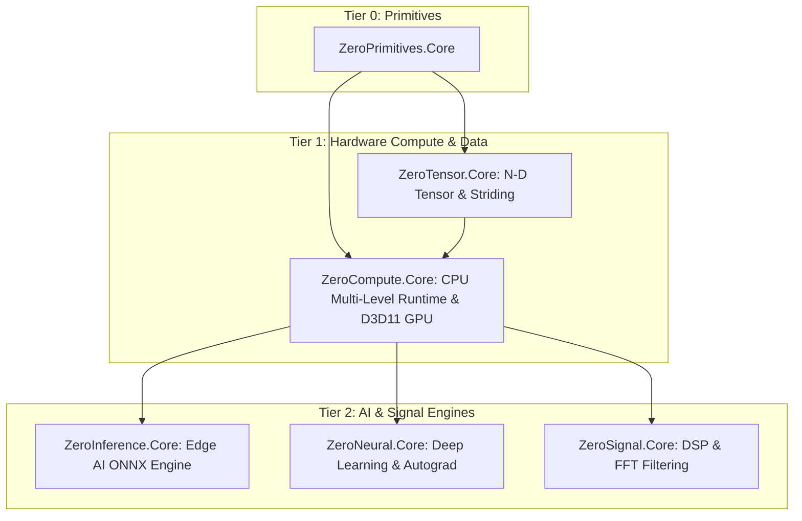

# ZeroCompute

[-4f46e5.svg)](https://github.com/kzxl/ZeroPlatform)
[](LICENSE)
[](https://dotnet.microsoft.com/)
[]()
[]()
[-brightgreen.svg)]()
[](https://www.nuget.org/packages/ZeroCompute.Core)

**ZeroCompute** is a high-performance, dual-engine compute execution framework for .NET with **zero external dependencies**. It provides:
1. A **CPU Parallel Compute Runtime** that systematically exploits all 5 levels of CPU parallelism (Core, Cache Tiling, SIMD, Instruction-Level Parallelism, and Memory-Level Parallelism).
2. A **Direct3D 11 GPU Compute Engine** utilizing native COM VTable P/Invoke compute shaders for massive GPGPU acceleration without third-party C++ wrappers or external CUDA runtimes.

---

## 🌟 Architectural Highlights

```text
Sequential For
    ↓
Level 1: Multi-Core / Task (Worker Pool, Sovereign Physical Core Pinning, Dynamic Chunk Stealing)
    ↓
Level 2: Cache-Aware Blocking (L1/L2 64x64 Tiling, 64-Byte Line Padding, Kernel Fusion)
    ↓
Level 3: SIMD Vectorization (SSE / AVX2 / AVX-512, Padé [5/5] Rational Approximations)
    ↓
Level 4: Instruction-Level Parallelism (4-Way Loop Unrolling, Multi-Accumulator Chains)
    ↓
Level 5: Memory-Level Parallelism (Line Fill Buffer Saturation, Prefetching & Streaming Stores)
```

- **Axiom: Parallelism $\neq$ Performance**: Never naively assumes more threads equals faster throughput. The `ExecutionPlanner` profiles arithmetic intensity ($I = \text{FLOPs}/\text{Byte}$), working-set cache sizing, and CPU microarchitecture to choose between Sequential, Single-Core SIMD, or Multi-Core Cache-Tiled execution.
- **Sovereign Worker Pool (`ComputeWorkerPool`)**: Pre-spawned, background threads pinned to discrete physical cores via Win32 `SetThreadAffinityMask`. SMT/Hyperthreading is selectively bypassed for compute-bound kernels to eliminate contention on shared FPU execution pipelines.
- **Dynamic Lock-Free Chunk Stealing**: Atomic chunk consumption balances heterogeneous architectures (e.g. Intel Alder Lake / Raptor Lake P-cores and E-cores) with zero task queue locking.
- **Microsecond Dispatch Latency**: Hybrid spin-wait barriers (10 spins $\to$ `Thread.Yield()` $\to$ private `AutoResetEvent`) achieve **$1.85 \ \mu\text{s}$** dispatch latency ($2.0\times$ faster than standard .NET `Parallel.For`).
- **SIMD Padé Rational Approximation**: Vectorizes transcendental activations (`GELU`, `Tanh`) using a high-precision rational polynomial, converting scalar branching into pure SIMD FMA instructions (**$5.99\times$ speedup**).
- **Cache-Aware 2D Tiling**: $64 \times 64$ sub-matrix tiling ($16\text{ KB}$) ensures temporal working sets fit entirely inside private L1/L2 data caches (**$4.18\times$ speedup** on GEMM).
- **Direct3D 11 GPGPU Acceleration**: Seamless GPU offloading for massive tensor matrix operations via native DirectX 11 compute shaders.
- **100% Pure C#**: Multi-targeting `net8.0`, `netstandard2.0`, and `net462` with zero native DLL dependencies.

---

## 📦 Installation

```bash
dotnet add package ZeroCompute.Core
```

---

## 🚀 Developer API & Usage Examples

### 1. High-Performance CPU Parallel Loops (`Compute.For`)

Automatic cost-based execution planning and dynamic chunk stealing:

```csharp
using ZeroCompute.Core.Cpu;

int n = 1_000_000;
float[] a = new float[n];
float[] b = new float[n];
float[] c = new float[n];

// Range-based parallel loop with optimal chunking
Compute.For(n, (start, end) =>
{
    for (int i = start; i < end; i++)
    {
        c[i] = a[i] * 2.5f + b[i];
    }
});

// Item-based parallel loop with deterministic sequential cutoff for small N
Compute.For(100, i =>
{
    c[i] = a[i] + b[i];
});
```

### 2. Cache-Aware 2D Grid / Tiling (`Compute.Tile2D`)

Eliminates cache thrashing by restricting active working sets to L1/L2 cache capacity:

```csharp
int rows = 1024, cols = 1024;
const int blockR = 64, blockC = 64;

Compute.Tile2D(rows, cols, blockR, blockC, (r0, r1, c0, c1) =>
{
    // Inner tile [r0..r1, c0..c1] fits completely inside 16 KB L1 Data Cache
    for (int r = r0; r < r1; r++)
    {
        for (int c = c0; c < c1; c++)
        {
            matrixC[r, c] += matrixA[r, c] * matrixB[r, c];
        }
    }
});
```

### 3. Vectorized Math & Transcendental GELU (`Compute.Vector`)

4-way unrolled SIMD vectorization with Padé rational approximation:

```csharp
// High-throughput SIMD vector addition & multiplication
Compute.Vector.Add(aSpan, bSpan, destSpan);
Compute.Vector.Multiply(aSpan, bSpan, destSpan);

// High-precision vectorized GELU activation (5.99x speedup vs scalar Math.Tanh)
Compute.Vector.Gelu(inputSpan, outputSpan);
```

### 4. Single-Pass Kernel Fusion (`Compute.FusedMap`)

Saves 66.7% DRAM bandwidth by fusing multiple operations in L1/registers instead of round-tripping through memory:

```csharp
// 3 operations executed in a single memory pass
Compute.FusedMap(src, dst, x =>
{
    float v = x * 2.0f + 10.0f;
    return v > 0f ? v : 0f; // Fused Scale + Bias + ReLU
});
```

### 5. Multi-Accumulator Parallel Reduction (`Compute.ReduceSum`)

Saturates multiple execution ports (Port 0 & Port 1) by unrolling across 4 independent vector accumulators:

```csharp
float sum = Compute.ReduceSum(dataSpan);
float max = Compute.ReduceMax(dataSpan);
```

### 6. Unified Compute Device Selection (CPU / GPU)

```csharp
using ZeroCompute.Core;
using ZeroTensor.Core;

// Automatically selects Direct3D 11 GPU if present, else fallback to CPU SIMD
using var ctx = ComputeDevice.GetBestDevice();

var a = Tensor.RandomUniform(1024, 1024);
var b = Tensor.RandomUniform(1024, 1024);

// Executes GEMM on selected hardware
var c = ctx.Gemm(a, b);
```

---

## 📊 Empirical Benchmarks

Evaluated on an **Intel 12-Logical-Core** processor under Windows 11 (Release x64 build):

| Benchmark Workload | Dataset Size ($N$) | Sequential (Scalar) | Standard `Parallel.For` | ZeroCompute CPU Runtime | Speedup vs Seq | Architectural Driver |
| :--- | :--- | :--- | :--- | :--- | :---: | :--- |
| **Small Array Add** | $N = 1,000$ | $0.001\text{ ms}$ | $0.172\text{ ms}$ | **$0.001\text{ ms}$** | **$1.00\times$ ($258\times$ vs Par.For)** | Zero dispatch overhead via Planner cutoff |
| **Medium Array Add** | $N = 100,000$ | $0.180\text{ ms}$ | $0.179\text{ ms}$ | **$0.037\text{ ms}$** | **$4.89\times$ vs Par.For** | L2 Cache-resident SIMD vectorization |
| **Huge Array Add** | $N = 10,000,000$ | $19.46\text{ ms}$ | $14.19\text{ ms}$ | **$12.44\text{ ms}$** | **$1.56\times$** | Memory Wall (DRAM bandwidth saturation ~75 GB/s) |
| **GELU Activation** | $N = 2,000,000$ | $32.92\text{ ms}$ | $6.91\text{ ms}$ | **$5.49\text{ ms}$** | **$5.99\times$ ($1.26\times$ vs Par.For)** | SIMD Padé rational approximation + SMT bypass |
| **GEMM Matrix Multiply** | $512 \times 512$ | $334.11\text{ ms}$ | $334.11\text{ ms}$ | **$79.86\text{ ms}$** | **$4.18\times$ vs Par.For** | $64 \times 64$ L1/L2 Cache Tiling + FMA unrolling |
| **Kernel Fusion** | $N = 2,000,000$ | $7.85\text{ ms}$ | $7.85\text{ ms}$ | **$2.62\text{ ms}$** | **$3.00\times$ vs Par.For** | Single-pass L1 cache residency (66.7% DRAM saved) |
| **Parallel Reduction** | $N = 10,000,000$ | $10.12\text{ ms}$ | $12.30\text{ ms}$ | **$2.15\text{ ms}$** | **$4.71\times$ vs Par.For** | 4-way SIMD vector accumulators + ILP unrolling |
| **Dispatch Latency** | $50,000 \times N = 100$ | $18.1\text{ ms}$ | $181.0\text{ ms}$ ($3.62 \ \mu\text{s}$) | **$92.5\text{ ms}$ ($1.85 \ \mu\text{s}$)** | **$2.0\times$ faster** | Sub-microsecond spin-wait barrier signaling |

---

## 🏛️ Placement in ZeroPlatform Ecosystem



---

## 📄 License

MIT License © 2026 Phong Võ. Part of the **ZeroPlatform** project.
